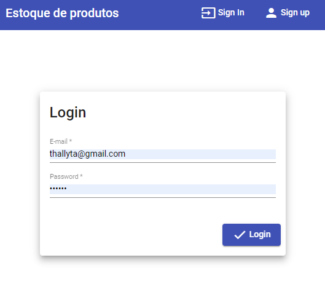
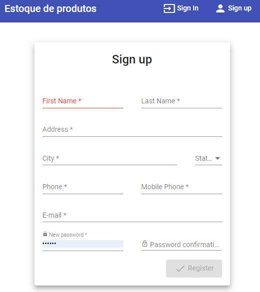
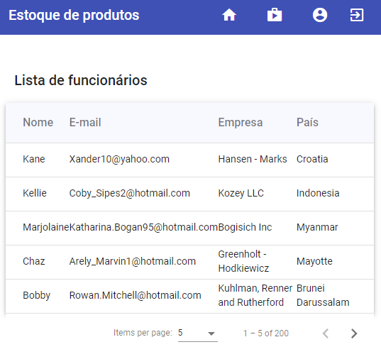
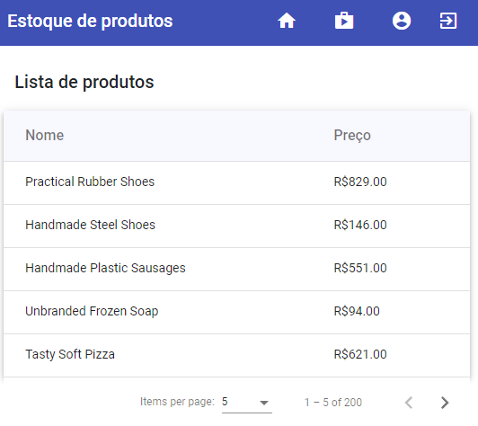
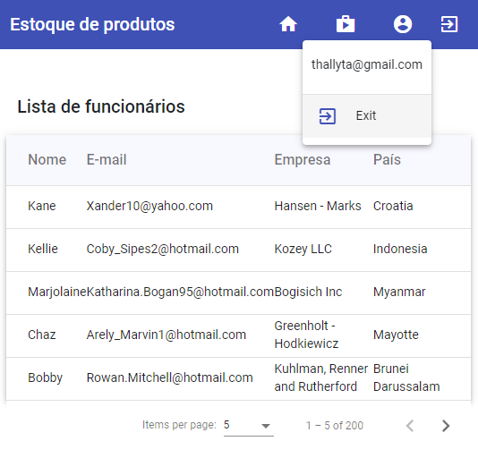

# Autenticação com Angular e NodeJs

<b> Este projeto foi criado com Angular CLI 14.1.0 no frontend e Node 16.16.0 no backend para criar uma autenticação baseada em token.</b>

# Sobre o projeto

Este projeto consiste em uma aplicação fullstack com Angular e NodeJs e banco de dados Mongodb com autenticação baseada em token e funcionalidades para se 
cadastrar no sistema e retornar dados de usuários cadastrados e produtos cadastrados em uma tabela no frontend.







# Tecnologias utilizadas

### Frontend

- Angular
- Angular Material
- Angular flex-layout
- Reactive Forms
- HttpClient com rxjs

### Backend

- bcryptjs
- body-parser
- cors
- express
- faker
- jsonwebtoken
- mongoose

# Iniciando o projeto

### Frontend

Para iniciar a aplicação execute o seguinte comando no terminal dentro da pasta frontend

```shell script
ng serve
```
### Backend

Para iniciar a aplicação execute o seguinte comando no terminal dentro da pasta backend

```shell script
node app.js
```
Execute os seguintes comandos para gerar os dados com faker na pasta backend

```shell script
node app.js
```

# Autor
<b>Thallyta Macedo Carvalho de Castro</b>

Linkedin: https://www.linkedin.com/in/thallyta-castro/

Medium: https://medium.com/@thallyta-castro-cv

email: contato@thallytacastro.com.br
